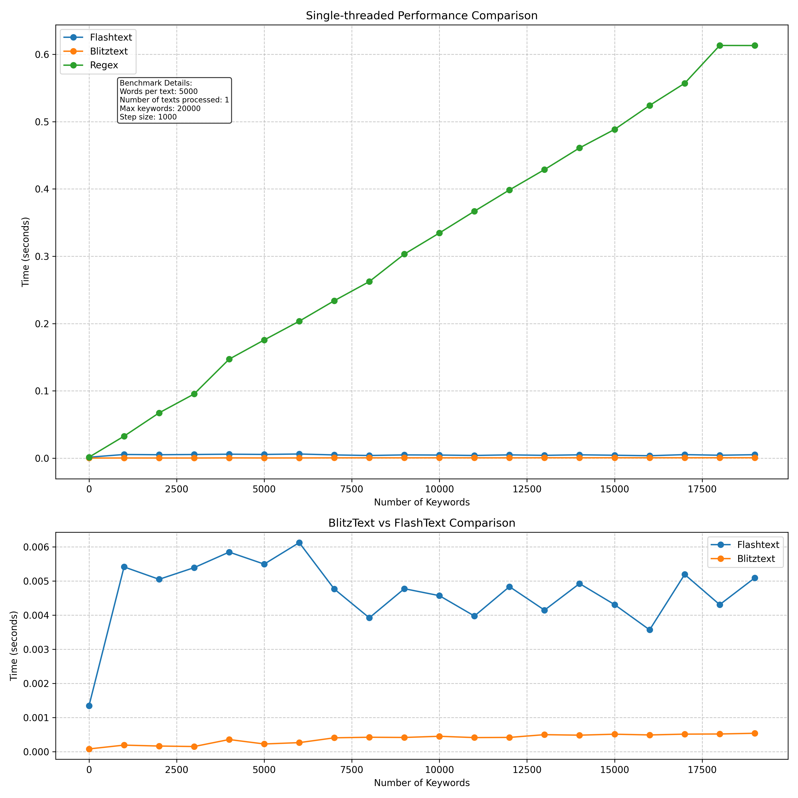
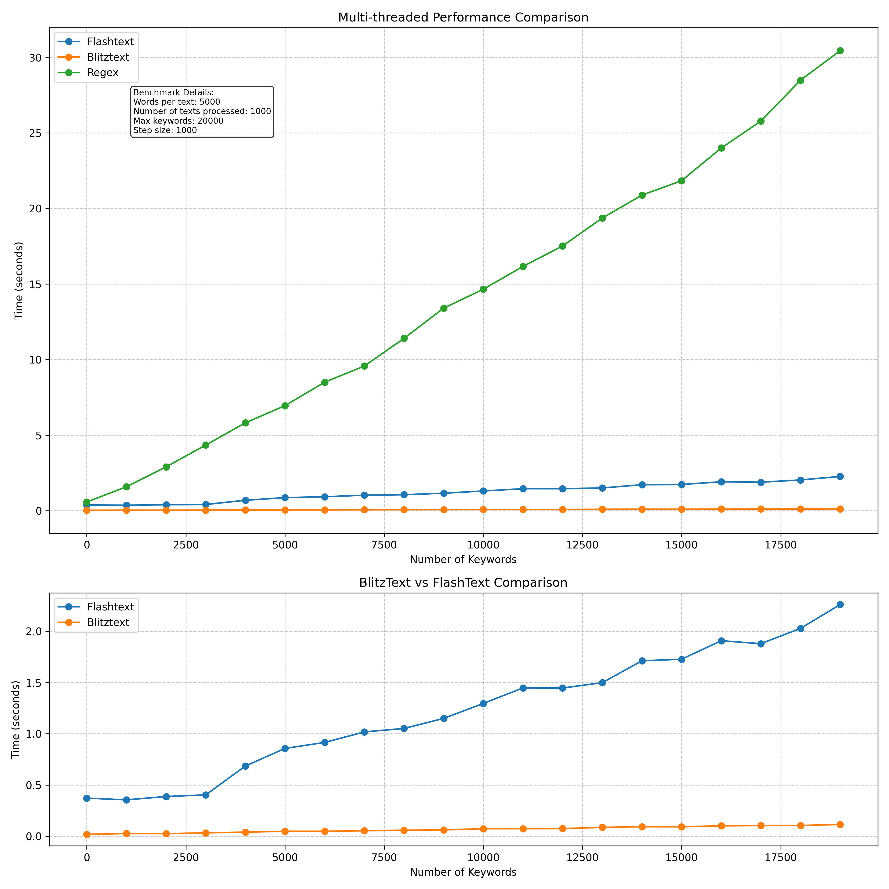

# BlitzText

BlitzText is a high-performance library for efficient keyword extraction and replacement in strings. It is based on the [FlashText](https://github.com/vi3k6i5/flashtext) and  [Aho-Corasick](https://en.wikipedia.org/wiki/Aho%E2%80%93Corasick_algorithm) algorithm. There are both Rust and Python implementations.
Main difference form Aho-Corasick is that BlitzText only matches the longest pattern in a greedy manner.



## Table of Contents
- [Installation](#installation)
- [Usage](#usage)
    - [Rust Usage](#rust-usage)
    - [Python Usage](#python-usage)
- [Features](#Features)
    - [1. Parallel Processing](#1-parallel-processing)
    - [2. Fuzzy Matching](#2-fuzzy-matching)
    - [3. Case Sensitivity](#3-case-sensitivity)
    - [4. Overlapping Matches](#4-overlapping-matches)
    - [5. Custom Non-Word Boundaries](#5-custom-non-word-boundaries)
- [Performance](#performance)
- [Contributing](#contributing)
- [License](#license)


## Installation

### Rust

Add this to your `Cargo.toml`:

```toml
[dependencies]
blitztext = "0.1.0"
```

or

```shell
cargo add blitztext
```


### Python

Install the library using pip:

```
pip install blitztext
```

## Usage

### Rust Usage

```rust
use blitztext::KeywordProcessor;

fn main() {
    let mut processor = KeywordProcessor::new();
    processor.add_keyword("rust", Some("Rust Lang"));
    processor.add_keyword("programming", Some("Coding"));

    let text = "I love rust programming";
    let matches = processor.extract_keywords(text, None);
    
    for m in matches {
        println!("Found '{}' at [{}, {}]", m.keyword, m.start, m.end);
    }

    let replaced = processor.replace_keywords(text, None);
    println!("Replaced text: {}", replaced);
    // Output: "I love Rust Lang Coding"
}
```

### Python Usage

```python
from blitztext import KeywordProcessor

processor = KeywordProcessor()
processor.add_keyword("rust", "Rust Lang")
processor.add_keyword("programming", "Coding")

text = "I love rust programming"
matches = processor.extract_keywords(text)

for m in matches:
    print(f"Found '{m.keyword}' at [{m.start}, {m.end}]")

replaced = processor.replace_keywords(text)
// Output: "I love Rust Lang Coding"

print(f"Replaced text: {replaced}")
```

## Features

### 1. Parallel Processing

For processing multiple texts in parallel:

```rust
// Rust
let texts = vec!["Text 1", "Text 2", "Text 3"];
let results = processor.parallel_extract_keywords_from_texts(&texts, None);
```

```python
# Python
texts = ["Text 1", "Text 2", "Text 3"]
results = processor.parallel_extract_keywords_from_texts(texts)
```


### 2. Fuzzy Matching

Both Rust and Python implementations support fuzzy matching:

```rust
// Rust
let matches = processor.extract_keywords(text, Some(0.8));
```

```python
# Python
matches = processor.extract_keywords(text, threshold=0.8)
```

### 3. Case Sensitivity

You can enable case-sensitive matching:

```rust
// Rust
let mut processor = KeywordProcessor::with_options(true, false);
processor.add_keyword("Rust", Some("Rust Lang"));
let matches = processor.extract_keywords("I love Rust and rust", None);
// Only "Rust" will be matched, not "rust"
```

```python
# Python
processor = KeywordProcessor(case_sensitive=True)
processor.add_keyword("Rust", "Rust Lang")
matches = processor.extract_keywords("I love Rust and rust")
# Only "Rust" will be matched, not "rust"
```

### 4. Overlapping Matches

Enable overlapping matches:

```rust
// Rust
let mut processor = KeywordProcessor::with_options(false, true);
processor.add_keyword("word", None);
processor.add_keyword("sword", None);
let matches = processor.extract_keywords("I have a sword", None);
// "word" will be matched
```

```python
# Python
processor = KeywordProcessor(allow_overlaps=True)
processor.add_keyword("word")
matches = processor.extract_keywords("I have a sword")
# "word" will be matched
```


### 5. Custom Non-Word Boundaries

This library uses the concept of non-word boundaries to determine where words begin and end. By default, alphanumeric characters and underscores are considered part of a word. You can customize this behavior to fit your specific needs.

#### Understanding Non-Word Boundaries

- Characters defined as non-word boundaries are considered part of a word.
- Characters not defined as non-word boundaries are treated as word separators.

#### Example

```rust
// Rust
let mut processor = KeywordProcessor::new();

processor.add_keyword("rust", None);
processor.add_keyword("programming", Some("coding"));

let text = "I-love-rust-programming-and-1coding2";

// Default behavior: '-' is a word separator
let matches = processor.extract_keywords(text, None);
assert_eq!(matches.len(), 2);
// Matches: "rust" and "coding"

// Add '-' as a non-word boundary
processor.add_non_word_boundary('-');

// Now '-' is considered part of words
let matches = processor.extract_keywords(text, None);
assert_eq!(matches.len(), 0);
// No matches, because "rust" and "programming" are now part of larger "words"
```

```python
# Python
processor = KeywordProcessor()

processor.add_keyword("rust")
processor.add_keyword("programming", "coding")

text = "I-love-rust-programming-and-1coding2"

# Default behavior: '-' is a word separator
matches = processor.extract_keywords(text)
assert len(matches) == 2
# Matches: "rust" and "coding"

# Add '-' as a non-word boundary
processor.add_non_word_boundary('-')

# Now '-' is considered part of words
matches = processor.extract_keywords(text)
assert len(matches) == 0
# No matches, because "rust" and "programming" are now part of larger "words"
```

#### Setting a whole new set of non-word boundaries

```rust
// Rust
processor.set_non_word_boundaries(&['-', '_', '@']);
```

```python
# Python
processor.set_non_word_boundaries(['-', '_', '@'])
```


## Performance

---

BlitzText is designed for high performance, making it suitable for processing large volumes of text.
Benchmark details [here](benches/benchmark_results.md).

Mult-threaded performance:


## Contributing

---

Contributions are welcome! Please feel free to submit a Pull Request.

## Issues
If you encounter any problems, please file an [issue](https://github.com/praise2112/blitztext/issues) along with a detailed description.

## License

---

This project is licensed under the [MIT License](https://github.com/praise2112/blitztext/blob/main/LICENSE).

